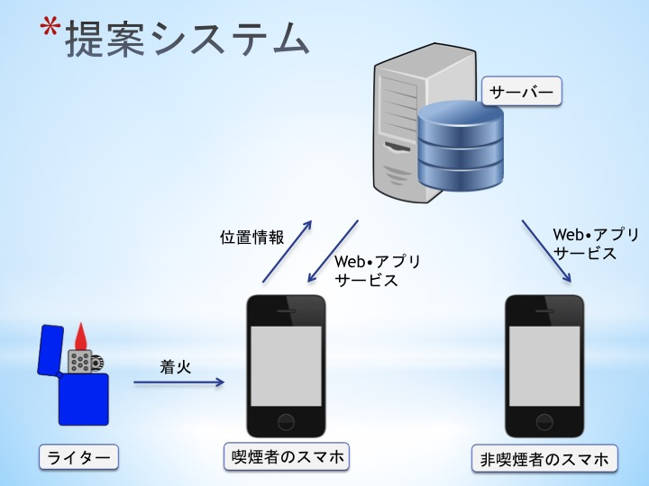

# ippuQ

## 製品概要

### 通信機能を備えたライターとスマートフォンアプリによる分煙ソリューション

### 背景(製品開発のきっかけ、課題等）

現在、様々な場所が喫煙禁止となっており、喫煙者は喫煙できる場所を探すのも一苦労。結果、隠れタバコが行われている始末である。しかし、タバコにも深い歴史や文化があり、果たして淘汰される一方でいいのだろうか。否、目指すべきは、喫煙者と非喫煙者が互いに住みよい社会を作ることである。

### 製品説明（具体的な製品の説明）

ippuQは、通信機能を備えたライター（以下、ippuQライター）とスマートフォンアプリ（以下、ippuQアプリ）から構成される。ippuQライターは、mACNiCA社のBLEモジュールkoshianと圧力センサを備えている。

ライター着火時の圧力を検知し、スマートフォンに通知を行う。スマートフォンはライター着火時の位置情報を位置情報を取得し、サーバーに送信する。サーバーでは蓄積されて喫煙場所情報から、現在利用可能な喫煙場所を割り出す。喫煙ユーザーは、タバコを吸いたいときは自分の位置情報の周囲の最近の喫煙場所がマーカーされたマップを参考に喫煙場所を探すことができる。

ippuQアプリは非喫煙者も利用可能であり、タバコNGステータスを設定することで喫煙ユーザーにアラートを送信することもできる。

ippuQライターには、その日吸ったタバコの本数が表示され、ippuQアプリから今までの喫煙記録を参照することもできる。喫煙情報のライフログ化により分煙・節煙に役立てることも可能。

### 特長

####1. ライターの着火をトリガーにして喫煙場所をデータベースに登録し、喫煙場所マップを常に更新
####2. 周囲にタバコNGの人がいた場合にアラートを受け取れる
####3. 吸ったタバコを本数をライターおよびアプリから管理確認できる

### 解決出来ること

* 喫煙場所マップが更新されることで利用可能な喫煙所を素早く検索
* タバコの本数を管理することでタバコの吸い過ぎの防止

### 今後の展望

* 喫煙場所データの有効活用（喫煙所の設置、タバコ市場のマーケティング調査）

### 注力したこと（こだわり等）

* koshianモジュールを用いた小型化
* Bluemixによるスケール可能なサーバー構成

## 開発技術
### 活用した技術
#### API・データ
* IBM Bluemix（コンテナ×2、ClearDB MySQL Database）

#### フレームワーク・ライブラリ・モジュール
* Flask（Python）

#### デバイス
* koshian

### 独自技術
#### ハッカソンで開発した独自機能・技術
* 独自で開発したものの内容をこちらに記載してください
* 特に力を入れた部分をファイルリンク、またはcommit_idを記載してください。
